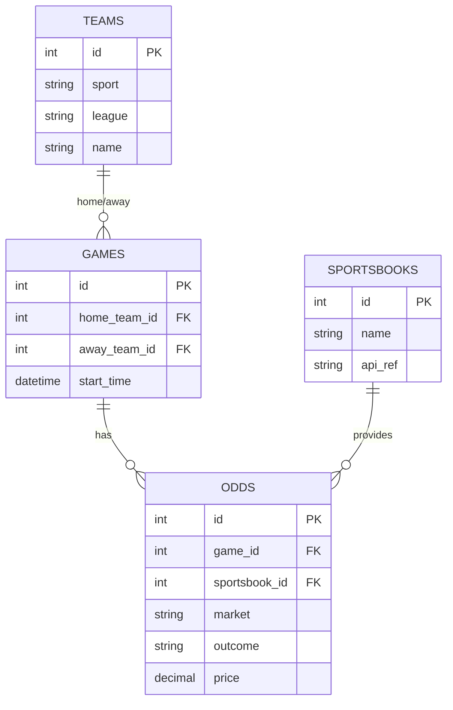

# 🏈 Sportsbook Assistant (MVP)

A FastAPI-based backend to aggregate sportsbook odds, normalize markets and player props, and serve structured data for analytics and intelligent querying.
This project acts as an **infrastructure blueprint for data-driven sports intelligence**, bridging ETL, analytics, and LLM-based reasoning in one developer-friendly stack.

---

## 📘 Overview

Sportsbook Assistant provides a foundation for:
- Comparing odds and props across major sportsbooks (FanDuel, DraftKings, BetMGM, ESPNBet, etc.)
- Ingesting data via APIs or batch scrapers
- Storing normalized historical odds in Postgres
- Enabling future LLM/RAG insights and semantic queries

It demonstrates best practices in containerized development, ETL orchestration, and AI-ready data engineering.

---

## 🛠 Technology Stack

| Layer | Technology | Purpose |
|-------|-------------|----------|
| **API** | FastAPI | High-performance REST backend |
| **ORM** | SQLAlchemy | Object-relational mapping |
| **Database** | Postgres | Structured odds and teams data |
| **Infra** | Podman + Devcontainer | Local development and reproducibility |
| **Dependency Mgmt** | `uv`, `pyproject.toml` | Python packaging and locking |
| **Migrations** | Alembic | Schema evolution |
| **CI/CD** | GitHub Actions (planned) | Testing and deployment automation |

---

## 🚀 Quick Start (Phase 1 – Local Dev)

### 1️⃣ Build and Run Dev Container
Ensure Podman is installed and running.

```bash
make build
make run
```
Then inside the container:
```bash
make serve
```
Access FastAPI at:
```bash
http://localhost:8000
```

### 2️⃣ Environment Variables

Copy .env.example → .env and define required values:
```bash
DATABASE_URL=postgresql+psycopg2://postgres:postgres@db:5432/sportsbook
POSTGRES_USER=postgres
POSTGRES_PASSWORD=postgres
```

> Note: Env files are ignored by Git.
> For CI/CD, set these as environment variables in GitHub Actions.

### 3️⃣ Current MVP Feature: Teams Endpoint
 Layer | Technology | Purpose |
|-------|-------------|----------|
| `POST` | `/teams` | Add a new team |
| `GET` | `/teams` | List all teams |

## 🧩 Project Structure
```bash
sportsbook-assistant/
├── src/app/
│   ├── main.py
│   ├── db.py
│   ├── routers/
│   ├── models/
│   ├── schemas/
│   ├── services/
│   └── utils/
├── infra/
│   ├── compose/
│   ├── docker/
│   └── devcontainer/
├── requirements/
├── tests/
└── docs/
    ├── VISION.md
    ├── ROADMAP.md
    └── ARCHITECTURE.md
```

## 🧪 Database Schema (Initial MVP)


## 🔁 Development Workflow
1. Create a feature branch:
2. Build and test locally.
3. Commit cleanly (`.env`, `.DS_Store` ignored).
4. Open a pull request to merge into `v0.1/main`.

## 📘 Documentation
| Document                                    | Purpose                               |
| ------------------------------------------- | ------------------------------------- |
| [`VISION.md`](./docs/VISION.md)             | Why this project exists               |
| [`ROADMAP.md`](./docs/ROADMAP.md)           | Development milestones                |
| [`ARCHITECTURE.md`](./docs/ARCHITECTURE.md) | System design and technical rationale |

## 💡 Philosophy
>The Sportsbook Assistant is not just a betting tool—it’s an infrastructure blueprint for data-driven sports intelligence, connecting ETL, analytics, and LLM-based reasoning into one developer-friendly stack.
