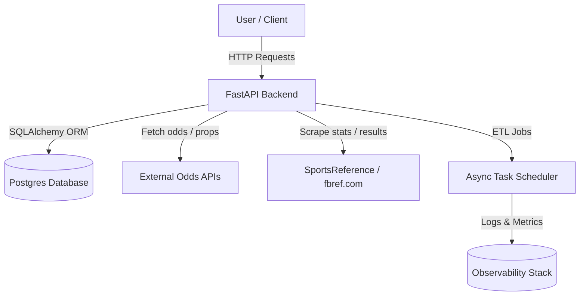
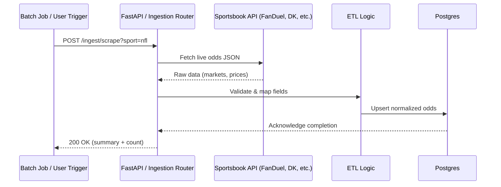
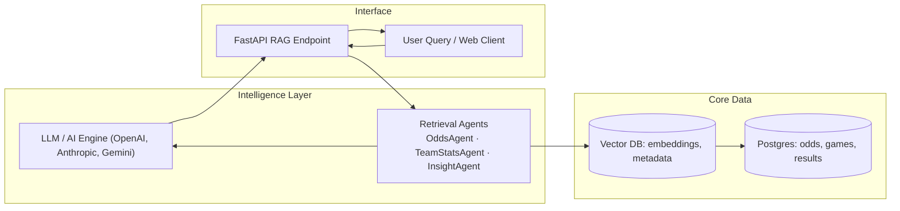
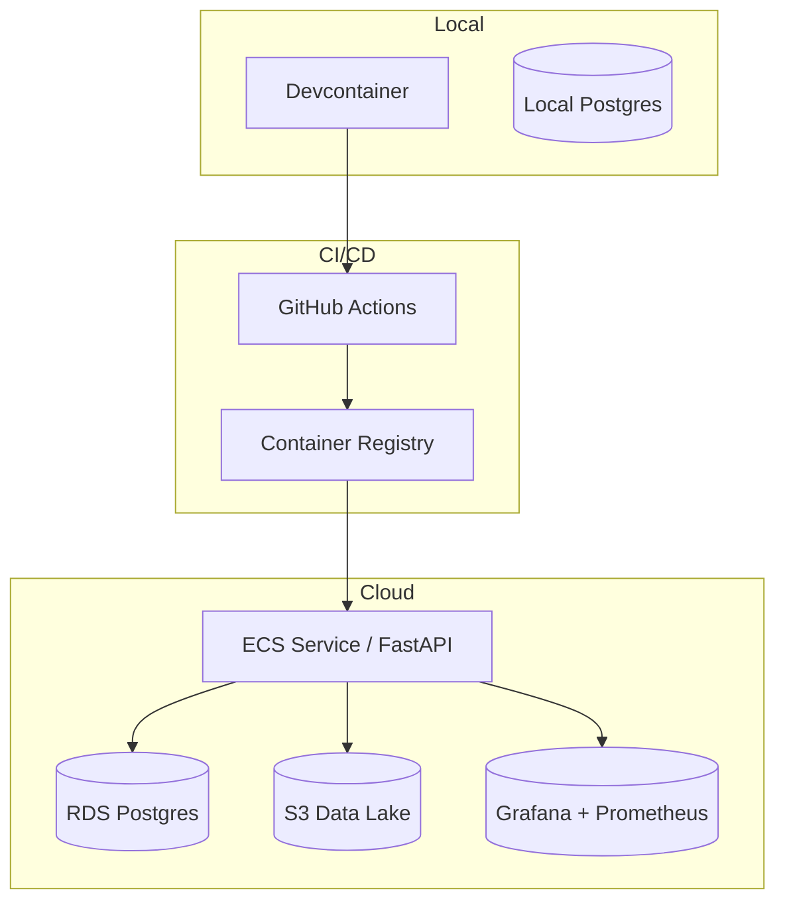

# 🧱 Sportsbook Assistant — Architecture Overview

This document describes the system architecture, data flows, and design rationale for the **Sportsbook Assistant** project.
It complements the `README.md` (how to use it), the `VISION.md` (why it exists), and the `ROADMAP.md` (where it’s going).

---

## 1️⃣ System Overview

The Sportsbook Assistant is composed of three main domains:

- **API Layer (FastAPI)** — Exposes REST endpoints for CRUD operations, ingestion triggers, and analytics queries.
- **Data Layer (Postgres + SQLAlchemy)** — Stores normalized entities (teams, games, odds, sportsbooks, box scores).
- **Integration Layer (External APIs / Scrapers)** — Fetches live and historical sports data from sportsbooks and public data sources (The Odds API, fbref.com, pro-football-reference.com).

### High-Level Architecture

Key principles:
- Modular services and routers for maintainability (`/teams`, `/games`, `/odds`).
- Async I/O for efficient data fetches from multiple APIs.
- ORM-backed persistence with future Alembic migrations.
- Containerized runtime for reproducibility.

---

## 2️⃣ Data Ingestion Flow (ETL / Scraping / Validation)

The ingestion subsystem normalizes heterogeneous data from sportsbooks and sports stats providers.

**ETL Stages**:
1. **Extract** — API fetch or scraper job retrieves data.
2. **Transform** — Data normalized to canonical schema (`market`, `outcome`, `price`, `timestamp`).
3. **Load** — ORM inserts or upserts into Postgres.
4. **Validate** — Pydantic models enforce schema and type safety.
5. **Log** — Job metadata recorded for auditability.

**ETL Validation Rules**:
- Ensure every `sportbook` entry references a valid source.
- Convert odds into a consistent decimal format.
- Normalize field names (`market_type`, `outcome`, `price`, `timestamp`).
- Maintain an immutable audit trail via a `jobs` table (job_id, source, started_at, completed_at, status).

---

## 3️⃣ Component Interaction — Future RAG & AI Layer

Future phases extend the architecture into semantic search and intelligent insights via RAG (Retrieval-Augmented Generation).

Goals
- Enable semantic queries such as:
  > “Which sportsbook historically undervalues Premier League away teams?”
- Use embeddings (pgvector / Qdrant) to represent historical and contextual data.
- Allow multi-step reasoning via specialized AI agents interacting with your structured backend.
---

## 4️⃣ Deployment Topology

The system follows a local → CI → cloud lifecycle pattern.

**Local (Development)**
- Podman + Devcontainer provides reproducible developer environments.
- Source code mounted live from host → container.
- Local Postgres instance (sportsbook-db) accessible via localhost:5432.
- Developer can test endpoints and run migrations without cloud dependencies.

**Continuous Integration (CI)**
- GitHub Actions builds container image, runs tests, and scans dependencies.
- Test secrets injected from repository settings.
- Linting and static analysis ensure code and schema hygiene.
- Build artifacts pushed to a container registry.

**Cloud Deployment (Target)**
- Managed via Terraform for infrastructure as code.
- Deployed to AWS ECS or EKS with RDS Postgres and S3 cold storage.
- Optional Step Functions or EventBridge to orchestrate ETL jobs.
- CloudWatch, Prometheus, or Grafana for monitoring and metrics.

---

## 5️⃣ Security and Observability
Security

- **Environment Variables**
  - `.env` files for local only; ignored in `.gitignore`.
  - GitHub Actions secrets for CI/CD.
  - Cloud secrets managed via AWS Secrets Manager or Vault.

- **Database Access Control**
  - Separate DB users for app, migration, and analytics layers.
  - Role-based permissions in production.
- API Authentication (Future)
  - JWT tokens or API keys to restrict external access.
- Dependency & Image Scanning
  - Trivy or Snyk for vulnerabilities in container and dependencies.

**Observability**
- **Structured Logging**
  - Log context (job_id, source, latency) via `loguru` or `structlog`.
- **Metrics & Dashboards**
  - Prometheus metrics exposed via `/metrics` endpoint.
  - Grafana visualizations for job success rate, API latency, and data freshness.

- **Tracing (Planned)**
  - OpenTelemetry for distributed tracing across API, ETL, and DB layers.
- **Alerts**
  - Slack or email notifications for failed jobs or long-running queries.

---
## 6️⃣ Architecture Evolution

| Stage       | Focus                          | Key Additions                               |
| ----------- | ------------------------------ | ------------------------------------------- |
| **Phase 1** | MVP (Local FastAPI + Postgres) | Teams endpoint, local container setup       |
| **Phase 2** | ETL + Ingestion                | Batch jobs, API connectors, validation      |
| **Phase 3** | Cloud CI/CD                    | Terraform, GitHub Actions, ECS/RDS          |
| **Phase 4** | AI / RAG                       | Vector DB, embeddings, agents               |
| **Phase 5** | Open Platform                  | SDKs, plugin system, contributor governance |

---

## 7️⃣ Design Philosophy

> *The Sportsbook Assistant is not just a betting tool—it’s an infrastructure blueprint for data-driven sports intelligence, connecting ETL, analytics, and LLM-based reasoning into one developer-friendly stack.*

This architecture embodies:
- **Reproducibility** through containers and IaC
- **Scalability** via modular microservices and cloud orchestration
- **Extensibility** for future LLM integration and agent workflows
- **Transparency** via documentation, versioned infrastructure, and metrics
